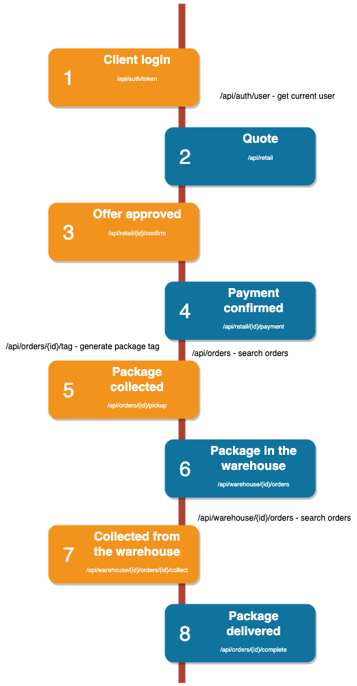
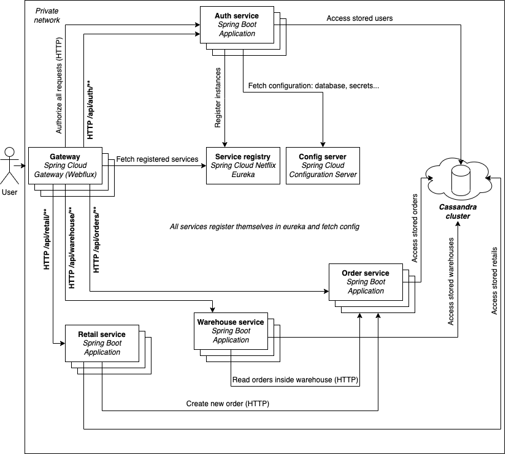

# Delivery system

This is a very simple system fo a delivery company which exposes a simple REST API. The main process looks like this:



## Architecture
The system has microservice architecture and each service is written in Java 11 with Spring Boot (+ Cloud).



## Requirements
JDK 11 and maven is required to build and run the project. Apache Cassandra is used as a database and has to be set up in
order to run the system. There is ready docker-compose file prepared which can setup a simple instance for You. If you
have Docker engine running on your computer You can type the following command:
```docker-compose up```


## Build & run
To install dependencies and build all servcies type:
```mvn package```

Configuration of all services is stored in:
```config-server/src/main/resources/config```

Remember to update cassandra configuration in all files localte din this dir.

Each service has to be run separately (in different terminal) (in this order):
```
java -jar service-registry/target/service-registry-1.0-SNAPSHOT.jar

java -jar config-server/target/config-server-1.0-SNAPSHOT.jar

java -jar auth-service/target/auth-service-1.0-SNAPSHOT.jar

java -jar order-service/target/order-service-1.0-SNAPSHOT.jar

java -jar retail-service/target/retail-service-1.0-SNAPSHOT.jar

java -jar warehouse-service/target/warehouse-service-1.0-SNAPSHOT.jar

java -jar api-gateway/target/api-gateway-1.0-SNAPSHOT.jar
```

It is possible that a service will fail to start - restarting it should help. 

!!!This is only a sample way to run the system for development it is much better to use InteliJ for development and
 create Dockerfiles for production!!!

## Usage
The REST API is documented with Swagger, visit the following url to open auto-generated documentation:

```http://localhost:8080/swagger-ui.html```